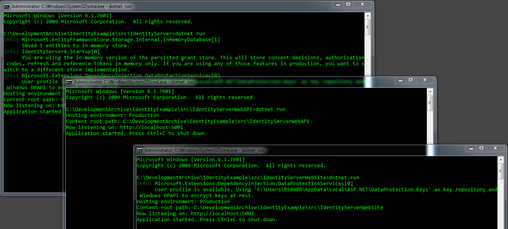
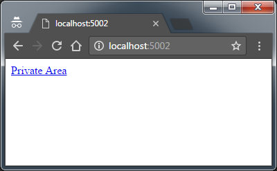
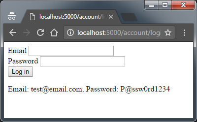
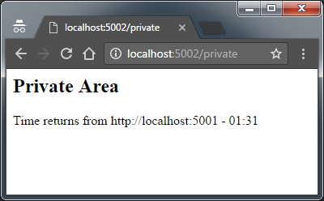

# Identity Example *(Single Sign-On)*
Sample project - two ASP.NET core web applications share same token generated from Identity Server 4.

***Requirement:*** *Visual Studio 2017*

## Run All Three Applications 
Launch all three applications - Web Application, Web Service and Identity Server.

## Web Application
If anonymous user browses a password protected page, s/he will be redirected to Identity Server.

## Login at Identity Server
 After successful login, user is redirected back to the web application with authentication token.

## Request data from API using Token
Web application can now access web service using same token generated by Identity Server.

